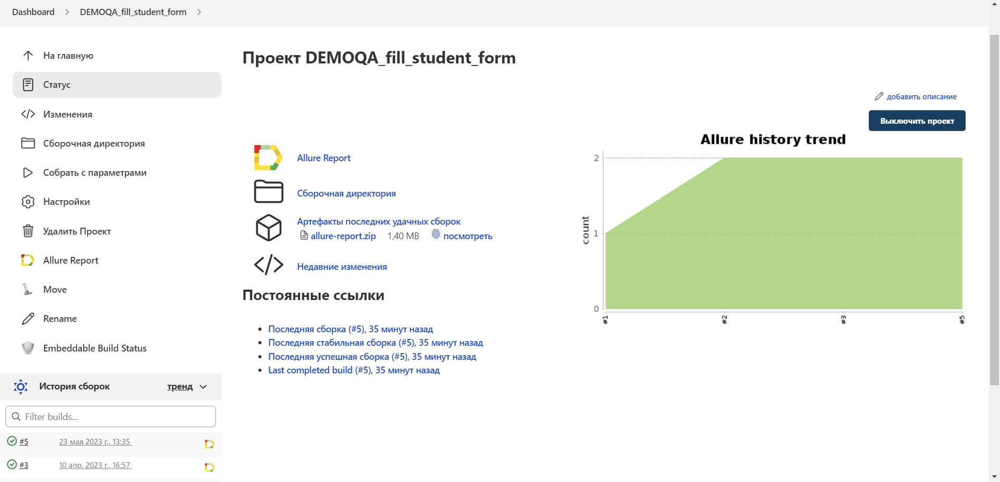
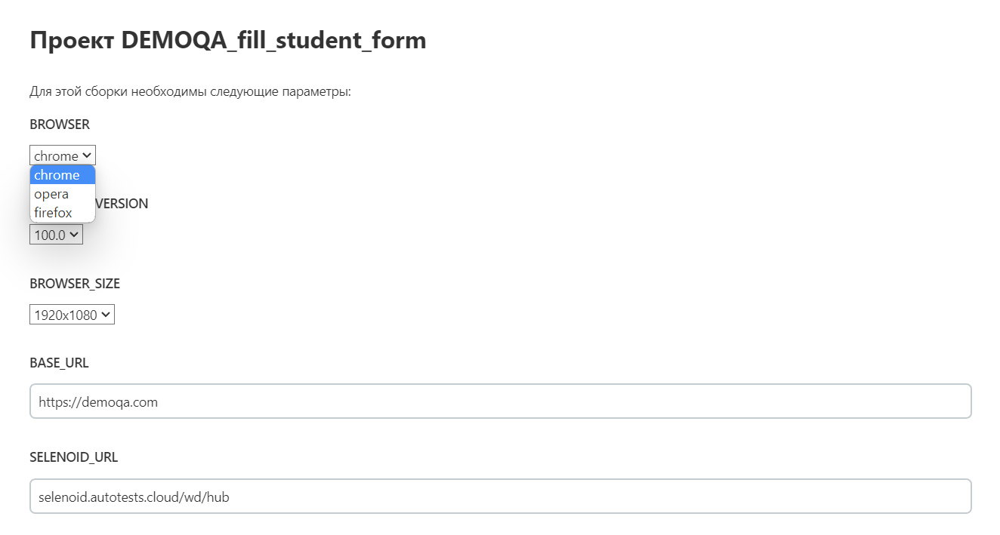
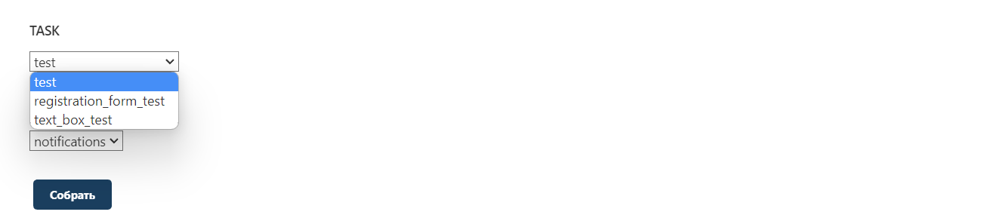
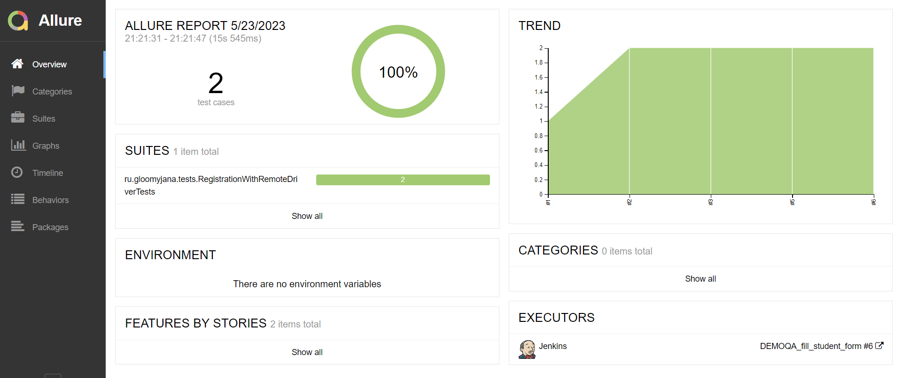
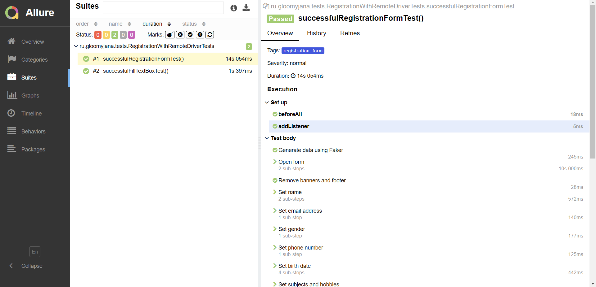
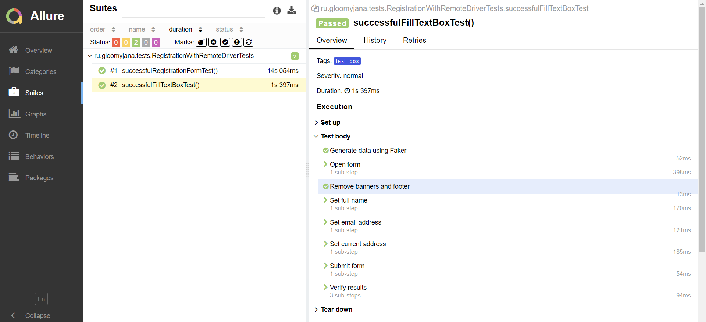
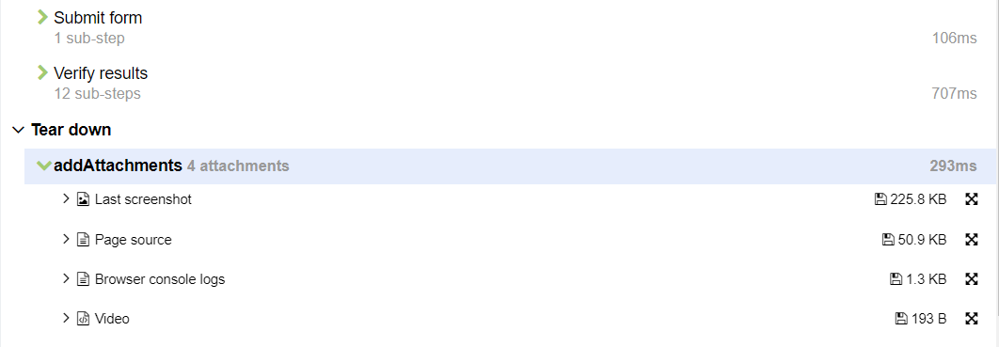
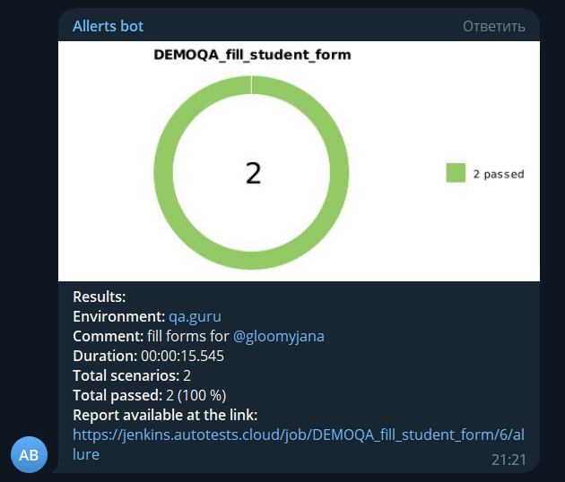
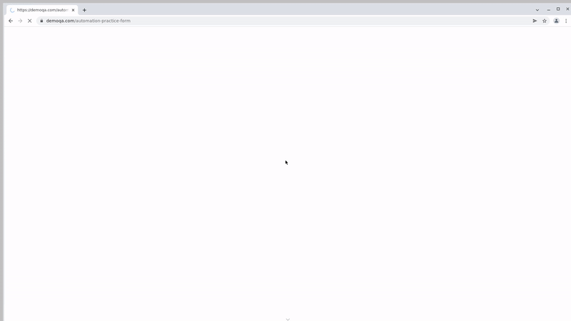

# Автоматизация тестирования для [DEMOQA](https://demoqa.com/)

## :page_facing_up: Cодержание
- [Описание, технологии и иструменты](#paperclip-описание,-технологии-и-иструменты)
- [Реализованные проверки](#white_check_mark-реализованные-проверки)
- [Сборка в Jenkins](#-сборка-в-jenkins)
- [Allure отчет](#-allure-отчет)
- [Уведомления в Telegram](#-уведомления-в-telegram)
- [Пример прогона теста в Selenoid](#-пример-прогона-теста-в-selenoid)

## :paperclip: Описание, технологии и иструменты

Демо проект состоит из UI-тестов для заполнения форм на сайте [DEMOQA](https://demoqa.com/) - Student Registration Form и Text Box. \
В проекте используется:
- [x] `Page Object` проектирование
- [x] Библиотека `JavaFaker` для генерации данных
- [x] Удаленная сборка (запуск тестов на удаленном браузере)
- [x] `Allure Report`
- [x] Уведомления в Telegram с использованием бота
- [x] Пример прогона теста в Selenoid

##  Сборка в Jenkins
[Сборка в Jenkins](https://jenkins.autotests.cloud/job/DEMOQA_fill_student_form/) 

Это параметризированная сборка, поэтому есть возможность выбрать браузер и версию и размер:

Также есть возможность выбора таска и ветки проекта: \

##  Allure отчет
Главная страница отчета Allure содержит следующие блоки:
- **ALLURE REPORT** - отображает дату и время теста, общее количество запущенных тестов, а также диаграмму с процентом и количеством успешных, упавших и сломавшихся в процессе выполнения тестов
- **TREND** - отображает тенденцию выполнения тестов для всех запусков
- **SUITES** - отображает распределение тестов по сьютам

 

Список тестов с шагами:

После каждого теста доступны дополнительные тестовые артефакты:
- Last Screenshot
- Page Source
- Browser console logs
- Video

##  Уведомления в Telegram

##  Пример прогона теста в Selenoid

 
